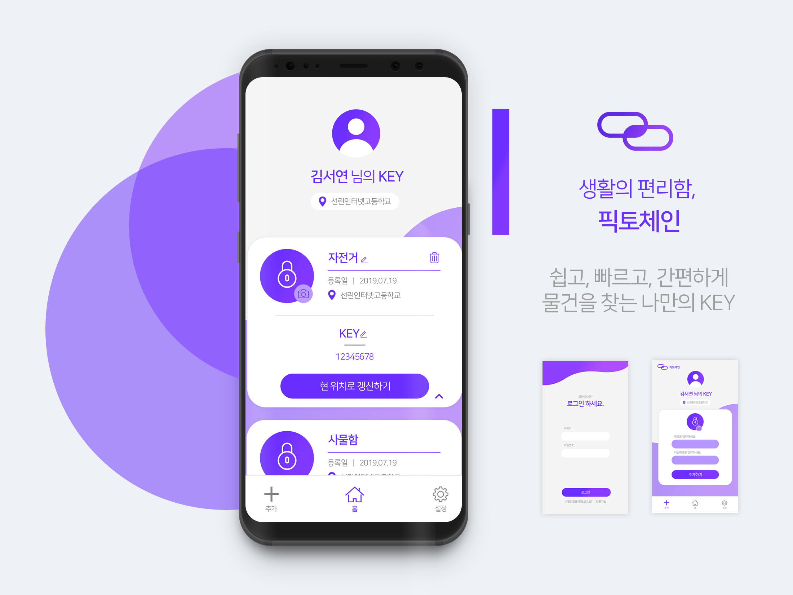
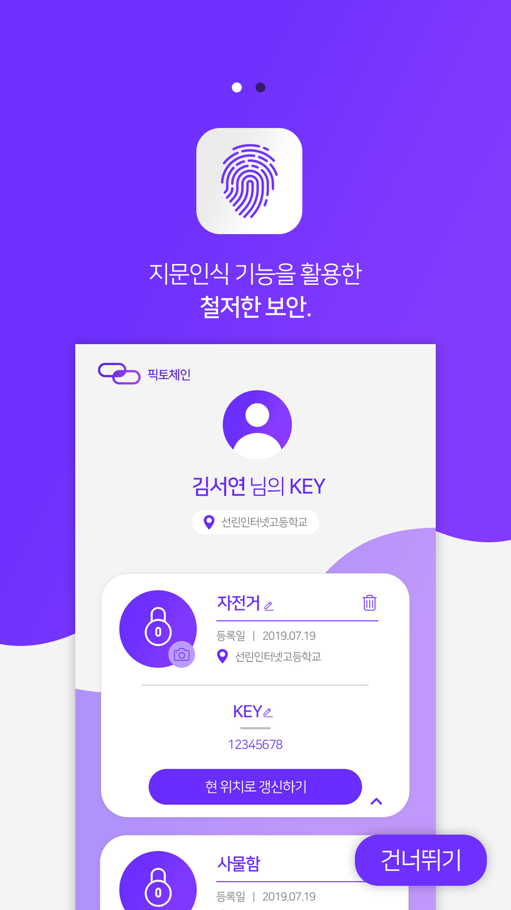
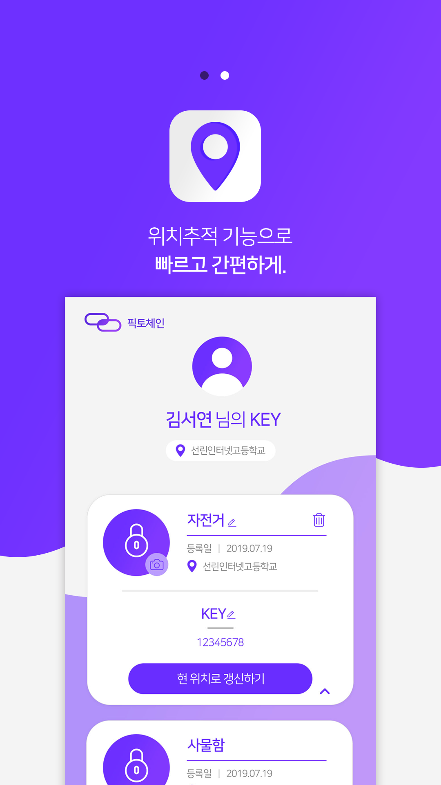

# PiktoChain

당신의 일상을 편리하게, 현실 자물쇠 키체인 서비스 PiktoChain

## 프로젝트 소개

오랜만에 타는 자전거의 자물쇠 번호를 잊어버리거나, 2년만에 꺼낸 여행용 캐리어의 비밀번호를 고민하던 경험. 누구에게나 있지 않나요? 픽토체인이 여러분의 문제를 해결해 드립니다!

PiktoChain은 자물쇠를 여는 도구인 Pick + 열쇠를 한곳에 모아 관리하는 Chain의 합성어로, 우리가 잊어버리기 쉬운 일상 속의 비밀번호를 한 곳에 모아 저장하고 관리하는 서비스입니다.

현실 속 자물쇠의 사진을 찍어 비밀번호와 함께 저장하고, 필요할 때 언제든지 확인하세요! 사용자의 소중한 비밀번호는 지문 인식으로 철처하게 보호됩니다.

자물쇠가 너무 많아 관리하기 어렵다고요? 픽토체인은 위치기반 서비스를 통해 자동으로 사용자에게 가장 가까운 자물쇠를 찾아 실시간으로 보여줍니다.

픽토체인과 함께 더 편리한 일상을 시작하세요!

## 개발 일정

- 2019 제 5회 선린 해커톤, Team **선린등대땔감** (2019/7/19 ~ 7/20)

## 수상 실적

- 2019 제 5회 선린 해커톤 **금상**

## 만든 사람들

- Team Leader, 김도현
- Backend Developer, 심영수
- Android Developer, 정찬효
- UI Designer, 김서연

## 스크린샷

